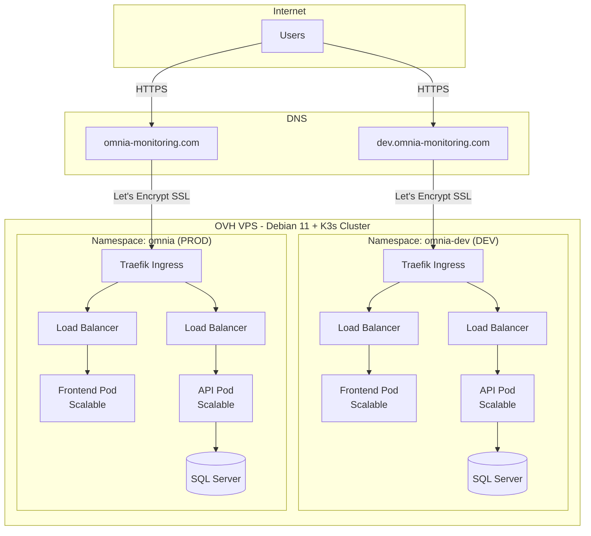

# 🚀 OMNIA Monitoring - Kubernetes Infrastructure

> Complete Kubernetes infrastructure for OMNIA monitoring application with automated CI/CD pipeline, SSL certificates, and zero-downtime deployments.

[](https://kubernetes.io/)
[](https://k3s.io/)
[](https://www.docker.com/)
[](https://github.com/features/actions)

## 📋 Table of Contents

- [Overview](#overview)
- [Architecture](#architecture)
- [Features](#features)
- [Prerequisites](#prerequisites)
- [Project Structure](#project-structure)
- [Quick Start](#quick-start)
- [Configuration](#configuration)
- [GitHub Secrets](#github-secrets)
- [Deployment](#deployment)
- [Usage](#usage)
- [Monitoring](#monitoring)
- [Troubleshooting](#troubleshooting)
- [Contributing](#contributing)

---

## 🎯 Overview

This repository contains a complete Kubernetes infrastructure for the OMNIA monitoring application, featuring:

- **Automated CI/CD**: GitHub Actions pipeline with 3 separate jobs
- **Multi-environment**: Separate DEV and PROD environments
- **Kustomize-based**: Clean configuration management with base + overlays
- **SSL Automated**: Let's Encrypt certificates via cert-manager
- **Zero Downtime**: Rolling updates with health checks
- **Database Included**: SQL Server StatefulSet with persistent storage

### Environments

| Environment | Branch | URL | Replicas |
|------------|--------|-----|----------|
| **Development** | `develop` | https://dev.omnia-monitoring.com | 1 |
| **Production** | `master` | https://omnia-monitoring.com | 2 |

---

## 🏗️ Architecture

### High-Level Architecture



### CI/CD Pipeline Flow

```
┌─────────────────────────────────────────────────────────┐
│              GITHUB REPOSITORY                          │
└─────────────────────────────────────────────────────────┘
         │                              │
         │ Push to develop              │ Push to master
         │                              │
         ▼                              ▼
┌────────────────────┐       ┌────────────────────┐
│ JOB 1: Build       │       │ JOB 1: Build       │
│ & Push Images      │       │ & Push Images      │
├────────────────────┤       ├────────────────────┤
│ • Build API        │       │ • Build API        │
│ • Build Frontend   │       │ • Build Frontend   │
│ • Push to ghcr.io  │       │ • Push to ghcr.io  │
│   - {sha}          │       │   - {sha}          │
│   - dev-latest     │       │   - prod-latest    │
└────────┬───────────┘       └────────┬───────────┘
         │                              │
         ▼                              ▼
┌────────────────────┐       ┌────────────────────┐
│ JOB 2: Deploy DEV  │       │ JOB 3: Deploy PROD │
├────────────────────┤       ├────────────────────┤
│ Namespace:         │       │ Namespace:         │
│   omnia-dev        │       │   omnia            │
│                    │       │                    │
│ 1. Setup kubectl   │       │ 1. Setup kubectl   │
│ 2. Create secrets  │       │ 2. Create secrets  │
│ 3. Apply manifests │       │ 3. Apply manifests │
│ 4. Update images   │       │ 4. Update images   │
│ 5. Wait rollout    │       │ 5. Wait rollout    │
└────────────────────┘       └────────────────────┘
```

---

## ✨ Features

### Infrastructure

- ✅ **Kustomize**: Configuration management with base + overlays pattern
- ✅ **Multi-environment**: Separate DEV and PROD with different settings
- ✅ **Namespace isolation**: Complete separation between environments
- ✅ **Persistent storage**: StatefulSet with PVC for database

### CI/CD

- ✅ **Automated pipeline**: 3 separate jobs (build, deploy-dev, deploy-prod)
- ✅ **Branch-based deployment**: 
  - `develop` → DEV environment
  - `master` → PROD environment
- ✅ **Container registry**: GitHub Container Registry (ghcr.io)
- ✅ **Image tagging**: SHA + environment-latest tags
- ✅ **Deployment validation**: Health checks and rollout status

### Security

- ✅ **SSL/TLS automated**: Let's Encrypt certificates via cert-manager
- ✅ **Secrets management**: Kubernetes secrets for sensitive data
- ✅ **HTTPS enforced**: All traffic encrypted
 
### High Availability

- ✅ **Zero downtime**: Rolling updates strategy
- ✅ **Health checks**: Readiness and liveness probes
- ✅ **Multiple replicas**: 2 instances in production
- ✅ **Resource limits**: CPU and memory constraints defined

### Developer Experience

- ✅ **Helper script**: `omnia.sh` for easy management
- ✅ **Complete documentation**: Detailed guides for every step
- ✅ **Troubleshooting**: Diagnostics included in pipeline

---

## 📦 Prerequisites

### Required

1. **OVH VPS** (or any VPS) running **Debian 11**
2. **K3s** installed on the VPS
3. **Domain names** pointing to VPS IP:
   - `omnia-monitoring.com`
   - `dev.omnia-monitoring.com`
4. **GitHub repository** with this code
5. **GitHub Actions** enabled

### Required on Local Machine

- `kubectl` installed
- `git` installed
- Access to your K3s cluster (kubeconfig)

### Optional but Recommended

- `stern` for log aggregation
- `k9s` for cluster visualization
- Docker for local testing

---

## 📁 Project Structure

```
omnia/
├── .github/
│   └── workflows/
│       └── ci-cd.yml                    # GitHub Actions pipeline
│
├── k8s/
│   ├── base/                            # Base Kubernetes configurations
│   │   ├── kustomization.yaml           # Kustomize base config
│   │   ├── serviceaccount.yaml          # ServiceAccount for CI/CD
│   │   ├── db-service.yaml              # Database service
│   │   ├── db-statefulset.yaml          # SQL Server StatefulSet
│   │   ├── api-service.yaml             # API service
│   │   ├── api-deployment.yaml          # API deployment
│   │   ├── front-service.yaml           # Frontend service
│   │   ├── front-deployment.yaml        # Frontend deployment
│   │   └── ingress-route.yaml           # Ingress with TLS
│   │
│   └── overlays/
│       ├── dev/                         # DEV-specific configs
│       │   ├── kustomization.yaml
│       │   └── patches.yaml             # DEV patches (host, replicas)
│       │
│       └── prod/                        # PROD-specific configs
│           ├── kustomization.yaml
│           └── patches.yaml             # PROD patches (host, replicas)
│
├── api/
│   ├── Dockerfile                       # API Docker image
│   └── ...                              # API source code
│
├── front/
│   ├── Dockerfile                       # Frontend Docker image
│   └── ...                              # Frontend source code
│
├── omnia.sh                             # Helper script for management
├── README.md                            # This file
├── GUIDE-INSTALLATION-VPS.md            # VPS setup guide
├── CONFIGURATION-GITHUB.md              # GitHub configuration guide
├── ARCHITECTURE.md                      # Architecture details
└── CHANGELOG.md                         # Version history
```

---

## 🚀 Quick Start

### 1. Server Setup (VPS)

Follow the complete guide in **GUIDE-INSTALLATION-VPS.md**. Summary:

```bash
# Connect to your VPS
ssh root@YOUR_VPS_IP

# Install K3s
curl -sfL https://get.k3s.io | sh -

# Install cert-manager
kubectl apply -f https://github.com/cert-manager/cert-manager/releases/download/v1.13.3/cert-manager.yaml

# Create ClusterIssuer for Let's Encrypt
kubectl apply -f - <<EOF
apiVersion: cert-manager.io/v1
kind: ClusterIssuer
metadata:
  name: letsencrypt-prod
spec:
  acme:
    server: https://acme-v02.api.letsencrypt.org/directory
    email: your-email@example.com
    privateKeySecretRef:
      name: letsencrypt-prod
    solvers:
    - http01:
        ingress:
          class: traefik
EOF

# Create namespaces
kubectl create namespace omnia-dev
kubectl create namespace omnia

# Create secrets
kubectl create secret generic omnia-secrets \
  --from-literal=db-password='YourStrongPassword123!' \
  --from-literal=connection-string='Server=db,1433;Database=Omnia;User Id=sa;Password=yourPassword;TrustServerCertificate=True;' \
  --namespace=omnia-dev

kubectl create secret generic omnia-secrets \
  --from-literal=db-password='YourStrongPasswordProd456!' \
  --from-literal=connection-string='Server=db,1433;Database=Omnia;User Id=sa;Password=yourPassword;TrustServerCertificate=True;' \
  --namespace=omnia
```

### 2. DNS Configuration

Configure your DNS records:

```
Type: A
Name: @
Value: YOUR_VPS_IP

Type: A
Name: dev
Value: YOUR_VPS_IP
```

### 3. GitHub Configuration

See **CONFIGURATION-GITHUB.md** for complete instructions.

#### Create GitHub Secrets

Go to: **Repository Settings → Secrets and variables → Actions → New repository secret**

**Required secrets (see detailed section below)**:
- `KUBECONFIG_DEV`
- `KUBECONFIG_PROD`
- `DB_PASSWORD`
- `CONNECTION_STRING_DEV`
- `CONNECTION_STRING_PROD`

#### Create GitHub Environments

Go to: **Repository Settings → Environments → New environment**

**Environment: dev**
- Name: `dev`
- Deployment branches: `develop`
- Environment URL: `https://dev.omnia-monitoring.com`

**Environment: prod**
- Name: `prod`
- Deployment branches: `master`
- Environment URL: `https://omnia-monitoring.com`
- ✅ Enable "Required reviewers" (recommended)

### 4. Deploy

```bash
# Deploy to DEV
git checkout develop
git add .
git commit -m "feat: initial deployment"
git push origin develop

# Watch the deployment in GitHub Actions
# Once successful, visit: https://dev.omnia-monitoring.com

# Deploy to PROD (after testing DEV)
git checkout master
git merge develop
git push origin master

# Visit: https://omnia-monitoring.com
```

---

## ⚙️ Configuration

### Component Configuration

#### Frontend
- **Image**: `ghcr.io/rmurier/omnia-front`
- **Port**: 80
- **Replicas**: 1 (DEV), 2 (PROD)
- **Resources**:
  - Requests: 50m CPU, 64Mi RAM
  - Limits: 300m CPU, 256Mi RAM

#### API
- **Image**: `ghcr.io/rmurier/omnia-api`
- **Port**: 8080
- **Replicas**: 1 (DEV), 2 (PROD)
- **Resources**:
  - Requests: 100m CPU, 256Mi RAM
  - Limits: 500m CPU, 512Mi RAM
- **Health Checks**:
  - Readiness: `/health` (initial 10s, period 5s)
  - Liveness: `/health` (initial 30s, period 10s)

#### Database
- **Image**: `mcr.microsoft.com/mssql/server:2022-latest`
- **Port**: 1433
- **Type**: StatefulSet
- **Storage**: 10Gi PersistentVolumeClaim
- **Replicas**: 1 (shared between environments)

### Customization

To change replicas, resources, or other settings:

**For DEV**:
```yaml
# k8s/overlays/dev/patches.yaml
apiVersion: apps/v1
kind: Deployment
metadata:
  name: omnia-api
spec:
  replicas: 3  # Change here
```

**For PROD**:
```yaml
# k8s/overlays/prod/patches.yaml
apiVersion: apps/v1
kind: Deployment
metadata:
  name: omnia-api
spec:
  replicas: 5  # Change here
```

---

## 🔐 GitHub Secrets

### Complete List of Required Secrets

#### 1. KUBECONFIG_DEV

**Description**: Base64-encoded kubeconfig for DEV namespace

**How to generate**:

```bash
# On your VPS, run:
kubectl create token github-deployer -n omnia-dev --duration=87600h > /tmp/token-dev.txt

# Create kubeconfig
cat <<EOF > /tmp/kubeconfig-dev.yaml
apiVersion: v1
kind: Config
clusters:
- cluster:
    certificate-authority-data: $(cat /etc/rancher/k3s/k3s.yaml | grep certificate-authority-data | awk '{print $2}')
    server: https://YOUR_VPS_IP:6443
  name: k3s-dev
contexts:
- context:
    cluster: k3s-dev
    namespace: omnia-dev
    user: github-deployer
  name: k3s-dev
current-context: k3s-dev
users:
- name: github-deployer
  user:
    token: $(cat /tmp/token-dev.txt)
EOF

# Encode in base64
cat /tmp/kubeconfig-dev.yaml | base64 -w 0 > /tmp/kubeconfig-dev-base64.txt

# Copy this value to GitHub secret KUBECONFIG_DEV
cat /tmp/kubeconfig-dev-base64.txt
```

**⚠️ Important**: Replace `YOUR_VPS_IP` with your actual VPS IP address!

---

#### 2. KUBECONFIG_PROD

**Description**: Base64-encoded kubeconfig for PROD namespace

**How to generate**:

```bash
# On your VPS, run:
kubectl create token github-deployer -n omnia --duration=87600h > /tmp/token-prod.txt

# Create kubeconfig
cat <<EOF > /tmp/kubeconfig-prod.yaml
apiVersion: v1
kind: Config
clusters:
- cluster:
    certificate-authority-data: $(cat /etc/rancher/k3s/k3s.yaml | grep certificate-authority-data | awk '{print $2}')
    server: https://YOUR_VPS_IP:6443
  name: k3s-prod
contexts:
- context:
    cluster: k3s-prod
    namespace: omnia
    user: github-deployer
  name: k3s-prod
current-context: k3s-prod
users:
- name: github-deployer
  user:
    token: $(cat /tmp/token-prod.txt)
EOF

# Encode in base64
cat /tmp/kubeconfig-prod.yaml | base64 -w 0 > /tmp/kubeconfig-prod-base64.txt

# Copy this value to GitHub secret KUBECONFIG_PROD
cat /tmp/kubeconfig-prod-base64.txt
```

**⚠️ Important**: Replace `YOUR_VPS_IP` with your actual VPS IP address!

---

#### 3. DB_PASSWORD

**Description**: SQL Server SA password (can be the same or different for dev/prod)

**Format**: Strong password with:
- Minimum 8 characters
- Uppercase letters
- Lowercase letters
- Numbers
- Special characters

**Example**: `MyStr0ng!P@ssw0rd2024`

**⚠️ Important**: Use a strong, unique password!

---

#### 4. CONNECTION_STRING_DEV

**Description**: SQL Server connection string for DEV environment

**Format**:
```
Server=db,1433;Database=Omnia;User Id=sa;Password=YOUR_DB_PASSWORD;TrustServerCertificate=True;
```

**Example**:
```
Server=db,1433;Database=Omnia;User Id=sa;Password=MyStr0ng!P@ssw0rd2024;TrustServerCertificate=True;
```

**⚠️ Important**: Replace `YOUR_DB_PASSWORD` with the actual password you chose in DB_PASSWORD

---

#### 5. CONNECTION_STRING_PROD

**Description**: SQL Server connection string for PROD environment

**Format**:
```
Server=db,1433;Database=Omnia;User Id=sa;Password=YOUR_PROD_DB_PASSWORD;TrustServerCertificate=True;
```

**Example**:
```
Server=db,1433;Database=Omnia;User Id=sa;Password=MyStr0ng!Pr0dP@ss2024;TrustServerCertificate=True;
```

**⚠️ Important**: 
- Use a DIFFERENT password for production!
- Replace `YOUR_PROD_DB_PASSWORD` with a strong production password

---

### Quick Reference Table

| Secret Name | Purpose | Where to Get It | Format |
|------------|---------|-----------------|--------|
| `KUBECONFIG_DEV` | K8s access for DEV | Generate on VPS | Base64 kubeconfig |
| `KUBECONFIG_PROD` | K8s access for PROD | Generate on VPS | Base64 kubeconfig |
| `DB_PASSWORD` | Database password | Create your own | Plain text, strong pwd |
| `CONNECTION_STRING_DEV` | DB connection DEV | Create with DB_PASSWORD | Connection string |
| `CONNECTION_STRING_PROD` | DB connection PROD | Create with different pwd | Connection string |

### Secrets Checklist

Before deploying, verify:

- [ ] All 5 secrets are created in GitHub
- [ ] KUBECONFIG files are properly base64 encoded
- [ ] KUBECONFIG files contain your VPS IP (not 127.0.0.1)
- [ ] DB_PASSWORD is strong (8+ chars, mixed case, numbers, special)
- [ ] CONNECTION_STRING_DEV uses the correct password
- [ ] CONNECTION_STRING_PROD uses a DIFFERENT password
- [ ] No typos in connection strings
- [ ] Secrets are in the correct GitHub repository

---

## 🚢 Deployment

### Automated Deployment (Recommended)

The CI/CD pipeline automatically deploys when you push:

```bash
# Deploy to DEV
git checkout develop
git add .
git commit -m "feat: your feature"
git push origin develop
# → Triggers automatic deployment to dev.omnia-monitoring.com

# Deploy to PROD
git checkout master
git merge develop
git push origin master
# → Triggers automatic deployment to omnia-monitoring.com
```

### Manual Deployment

Using kubectl directly:

```bash
# Deploy to DEV
kubectl apply -k k8s/overlays/dev

# Deploy to PROD
kubectl apply -k k8s/overlays/prod
```

Using the helper script:

```bash
# Deploy to DEV
./omnia.sh deploy dev

# Deploy to PROD
./omnia.sh deploy prod
```

---

## 📊 Usage

### Helper Script (omnia.sh)

The `omnia.sh` script provides easy commands for common tasks:

```bash
# Show status
./omnia.sh status dev
./omnia.sh status prod

# View logs
./omnia.sh logs dev api
./omnia.sh logs prod front

# Restart a service
./omnia.sh restart dev api
./omnia.sh restart prod front

# Scale a service
./omnia.sh scale dev api 3
./omnia.sh scale prod front 5

# Deploy manually
./omnia.sh deploy dev
./omnia.sh deploy prod

# Rollback to previous version
./omnia.sh rollback prod api

# Open shell in a pod
./omnia.sh shell dev api
./omnia.sh shell prod db

# View ingress details
./omnia.sh ingress dev

# View recent events
./omnia.sh events prod

# Update secrets
./omnia.sh secret dev

# Show help
./omnia.sh help
```

### kubectl Commands

```bash
# View all resources
kubectl get all -n omnia-dev
kubectl get all -n omnia

# View pods
kubectl get pods -n omnia-dev
kubectl get pods -n omnia

# View logs
kubectl logs -f deployment/omnia-api -n omnia-dev
kubectl logs -f deployment/omnia-front -n omnia-dev

# View ingress
kubectl get ingress -n omnia-dev
kubectl get ingress -n omnia

# View certificates
kubectl get certificate -A
kubectl describe certificate omnia-tls -n omnia

# View events
kubectl get events -n omnia-dev --sort-by='.lastTimestamp'

# Execute commands in pod
kubectl exec -it <pod-name> -n omnia-dev -- /bin/bash

# Port forward (for debugging)
kubectl port-forward svc/api 8080:8080 -n omnia-dev
```

### Scaling

```bash
# Scale up
kubectl scale deployment/omnia-api --replicas=5 -n omnia

# Scale down
kubectl scale deployment/omnia-api --replicas=1 -n omnia-dev
```

### Rollback

```bash
# View rollout history
kubectl rollout history deployment/omnia-api -n omnia

# Rollback to previous version
kubectl rollout undo deployment/omnia-api -n omnia

# Rollback to specific revision
kubectl rollout undo deployment/omnia-api --to-revision=3 -n omnia
```

---

## 🔍 Monitoring

### View Current Status

```bash
# All resources
kubectl get all -n omnia-dev

# Specific resources
kubectl get pods -n omnia-dev
kubectl get svc -n omnia-dev
kubectl get ingress -n omnia-dev
```

### View Logs

```bash
# Follow logs
kubectl logs -f deployment/omnia-api -n omnia-dev

# Last 100 lines
kubectl logs --tail=100 deployment/omnia-api -n omnia-dev

# All pods of a deployment
kubectl logs -f -l app=omnia-api -n omnia-dev
```

### Resource Usage

```bash
# Node resources
kubectl top nodes

# Pod resources
kubectl top pods -n omnia-dev
kubectl top pods -n omnia
```

### Health Checks

```bash
# Check pod health
kubectl get pods -n omnia-dev

# Describe pod (detailed info)
kubectl describe pod <pod-name> -n omnia-dev

# Check readiness/liveness probes
kubectl describe deployment/omnia-api -n omnia-dev
```

### SSL Certificates

```bash
# View all certificates
kubectl get certificate -A

# Certificate details
kubectl describe certificate omnia-dev-tls -n omnia-dev

# Certificate status
kubectl get certificaterequest -n omnia-dev
```

---

## 🐛 Troubleshooting

### Common Issues

#### 1. Pods not starting

```bash
# Check pod status
kubectl get pods -n omnia-dev

# Describe pod for events
kubectl describe pod <pod-name> -n omnia-dev

# Check logs
kubectl logs <pod-name> -n omnia-dev

# Check events
kubectl get events -n omnia-dev --sort-by='.lastTimestamp' | tail -20
```

**Common causes**:
- Image pull errors → Check image name and registry
- Resource limits → Increase resources or scale down
- Failed health checks → Check `/health` endpoint

#### 2. Ingress not working

```bash
# Check ingress
kubectl get ingress -n omnia-dev
kubectl describe ingress omnia -n omnia-dev

# Check traefik logs
kubectl logs -n kube-system -l app.kubernetes.io/name=traefik

# Test DNS
nslookup dev.omnia-monitoring.com
```

**Common causes**:
- DNS not propagated → Wait or check DNS configuration
- Certificate not ready → Check cert-manager logs
- Wrong host configuration → Verify ingress patches

#### 3. SSL certificate issues

```bash
# Check certificates
kubectl get certificate -A
kubectl describe certificate omnia-dev-tls -n omnia-dev

# Check cert-manager
kubectl get pods -n cert-manager
kubectl logs -n cert-manager -l app=cert-manager

# Check ClusterIssuer
kubectl get clusterissuer
kubectl describe clusterissuer letsencrypt-prod
```

**Common causes**:
- ClusterIssuer not created → Apply ClusterIssuer manifest
- DNS not resolving → Verify DNS records
- Rate limits → Let's Encrypt has rate limits, wait if hit

#### 4. Database connection issues

```bash
# Check database pod
kubectl get pods -n omnia-dev -l app=omnia-db

# Database logs
kubectl logs -n omnia-dev -l app=omnia-db

# Check secrets
kubectl get secret omnia-secrets -n omnia-dev
kubectl describe secret omnia-secrets -n omnia-dev

# Test connection from API pod
kubectl exec -it <api-pod> -n omnia-dev -- curl http://db:1433
```

**Common causes**:
- Secret not created → Create omnia-secrets
- Wrong connection string → Verify password and format
- Database not ready → Check StatefulSet status

#### 5. GitHub Actions failing

**Check these**:
- Secrets configured correctly in GitHub
- KUBECONFIG contains correct VPS IP (not 127.0.0.1)
- Namespaces exist on cluster
- Network access from GitHub to VPS (port 6443)

```bash
# Verify namespaces
kubectl get namespace | grep omnia

# Verify ServiceAccount
kubectl get serviceaccount github-deployer -n omnia-dev
kubectl get serviceaccount github-deployer -n omnia

```

### Debug Commands

```bash
# Get all resources in namespace
kubectl get all -n omnia-dev

# Wide output (shows node, IP, etc.)
kubectl get pods -n omnia-dev -o wide

# Detailed pod information
kubectl describe pod <pod-name> -n omnia-dev

# Events (recent first)
kubectl get events -n omnia-dev --sort-by='.lastTimestamp' | tail -50

# Check resource usage
kubectl top nodes
kubectl top pods -n omnia-dev

# Exec into pod
kubectl exec -it <pod-name> -n omnia-dev -- /bin/bash

# Port forward for testing
kubectl port-forward svc/api 8080:8080 -n omnia-dev
```

---

## 🤝 Contributing

### Development Workflow

1. **Create a feature branch**
   ```bash
   git checkout develop
   git pull origin develop
   git checkout -b feature/my-feature
   ```

2. **Develop and test locally**
   ```bash
   # Make your changes
   # Test locally
   ```

3. **Commit and push**
   ```bash
   git add .
   git commit -m "feat: add my feature"
   git push origin feature/my-feature
   ```

4. **Create Pull Request**
   - Open PR on GitHub
   - Target branch: `develop`
   - Wait for review

5. **Merge to develop**
   - After approval, merge PR
   - Automatic deployment to DEV

6. **Test on DEV**
   - Visit https://dev.omnia-monitoring.com
   - Verify your changes

7. **Deploy to PROD**
   ```bash
   git checkout master
   git merge develop
   git push origin master
   ```

### Coding Standards

- Write clear commit messages (conventional commits)
- Test locally before pushing
- Update documentation if needed
- Follow existing code style

---

## 📚 Additional Resources

- [Kubernetes Documentation](https://kubernetes.io/docs/)
- [K3s Documentation](https://docs.k3s.io/)
- [Kustomize Documentation](https://kustomize.io/)
- [cert-manager Documentation](https://cert-manager.io/docs/)
- [GitHub Actions Documentation](https://docs.github.com/en/actions)

---

## 📄 License

This project is licensed under the MIT License - see the LICENSE file for details.

---

## 👥 Team

- **Project Lead**: [Your Name]
- **Infrastructure**: [Your Name]

---

## 📞 Support

For issues and questions:

1. Check the documentation in this repository
2. Review troubleshooting section above
3. Check GitHub Actions logs
4. Open an issue on GitHub

---

## 🎉 Acknowledgments

- K3s team for the lightweight Kubernetes distribution
- cert-manager team for automated SSL certificates
- Kustomize team for clean configuration management

---

**Made with ❤️ for OMNIA Monitoring**

**Version**: 1.0.0  
**Last Updated**: January 26, 2026